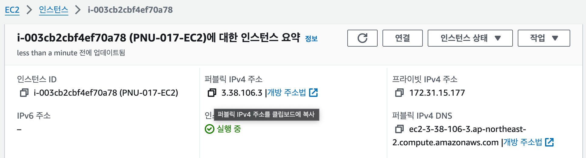
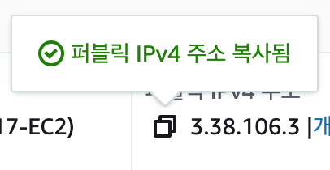
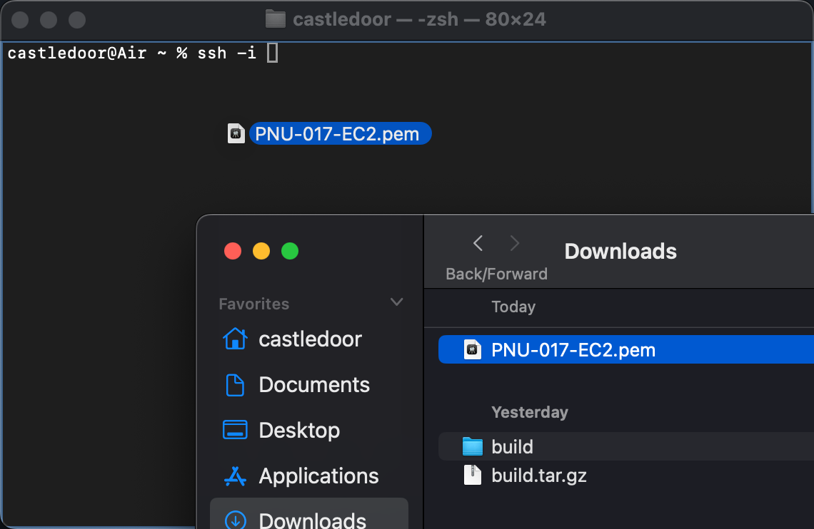
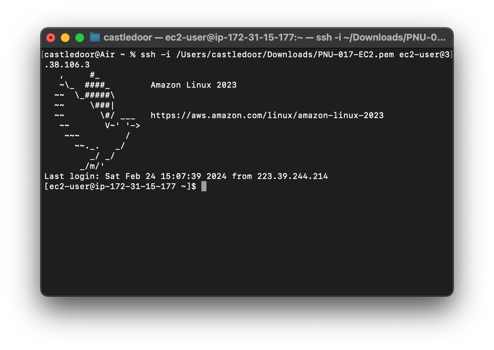
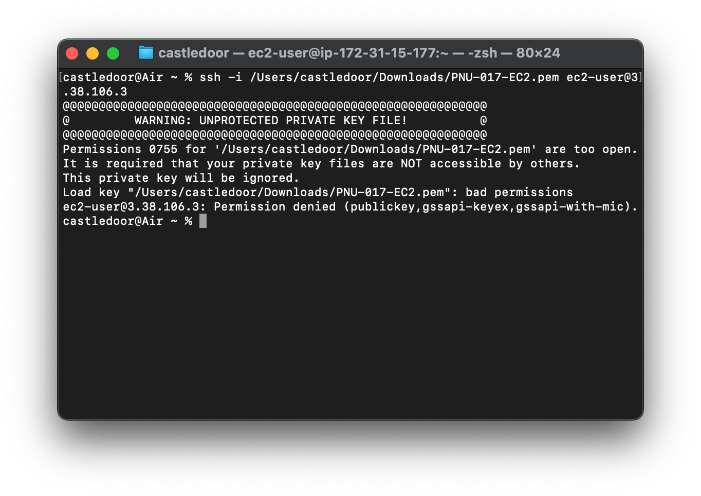
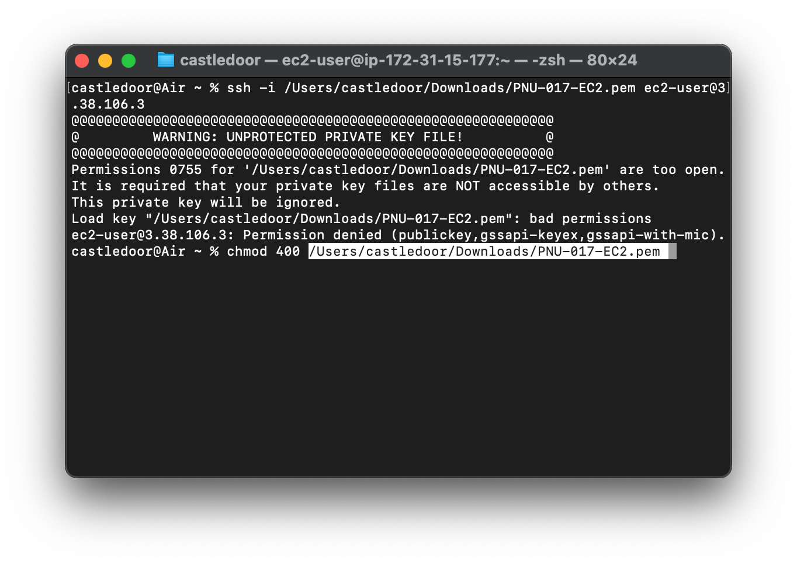
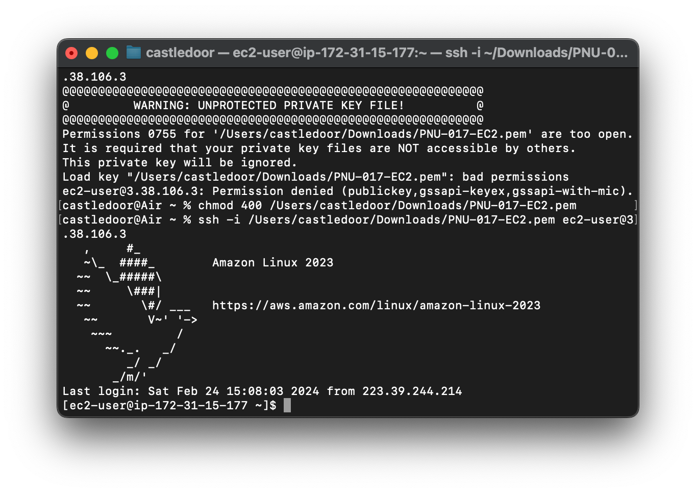

## 생성된 EC2 인스턴스에 연결하기 (SSH)
- EC2 인스턴스를 실행

 <!-- 실행 중 이미지 -->
- 인스턴스의 퍼블릭 IP(IPv4) 주소를 복사

 <!-- IPv4 주소 복사 버튼 호버 -->
 <!-- 복사버튼 클릭시 -->
- 인스턴스 생성시 선택한 키페어를 사용해 ssh 접속 (windows라면 `git bash` 프로그램을 통해 openSSH 사용 가능)
  
   `ssh -i {키 페어 경로} ec2-user@{인스턴스의 퍼블릭 IP 주소}`  //  이때 키 페어 파일을 터미널로 드래그해 경로를 입력할 수도 있습니다 (git bash도 가능)
   
 <!-- macOS terminal (Finder에서 드래그해서 파일 경로 입력하기) -->
- - -
- 성공!
 <!-- success -->

  
오류??
 
  인스턴스 생성 시 다운받은 키 페어의 접근 권한은 기본적으로 755(owner: rwx, group: r-x, others: r-x)입니다.  
  키 파일의 접근 권한이 너무 개방적일 경우 ssh에서 연결을 거부하기 때문에, <code>chmod 400 {키 페어 경로}</code> 를 통해 pem 파일의 접근 권한을 변경해줘야 합니다.
    <!-- 에러화면 -->
    <!-- chmod -->
  성공!   
   <!-- err-success -->

