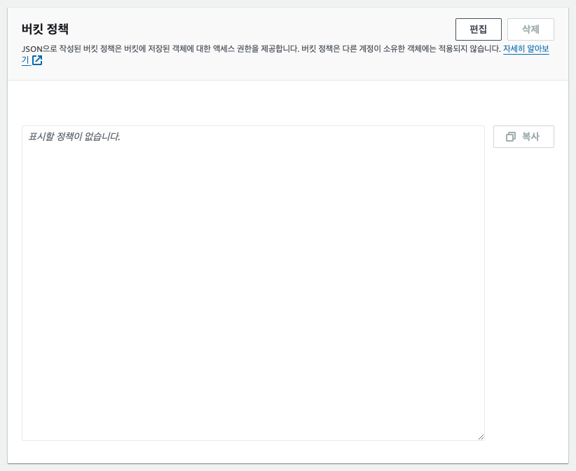

## S3 버킷으로 정적 웹 사이트 호스팅하기
- S3 버킷 생성하기


- 버킷 이름은 유니크해야 함! (Globally Unique)


- 기본적으로 버킷에 저장된 데이터들에 대한 `퍼블릭 엑세스`는 차단되어 있는데,  
웹 사이트 호스팅에 사용하기 위해서는 `퍼블릭 엑세스`를 허용해줘야 합니다


- 생성된 버킷의 정보 페이지에서 `권한` 탭으로 이동합니다


- 권한 탭 하단에 있는 `정책`을 편집해줍니다.

- 이때 버킷 정책은 json 형식으로 저장해줘야 합니다.
```json
{
    "Version": "2012-10-17",
    "Id": "{임의의 정책 식별자(Policy Identifier)}",
    "Statement": [
        {
            "Sid": "s3-public",
            "Effect": "Allow",
            "Principal": "*",
            "Action": "s3:GetObject",
            "Resource": "{버킷 ARN/*}"
        }
    ]
}
```

- 

