## EC2 컨테이너 생성
- 메뉴 > EC2

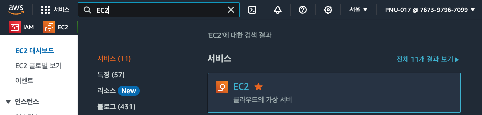 <!-- EC2 아이콘 -->
- 인스턴스 시작

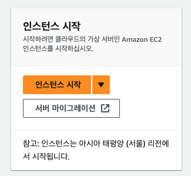 <!-- 인스턴스 시작 버튼 -->
- 인스턴스 이름 설정

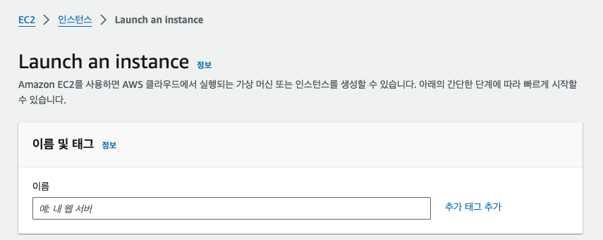 <!-- 인스턴스 이름 입력란 -->
- 인스턴스 유형 선택

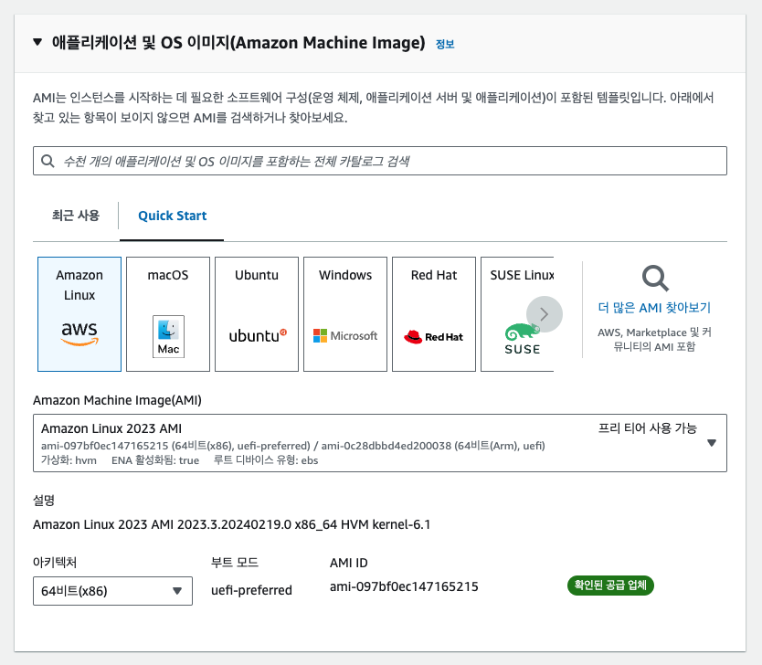 <!-- 인스턴스 유형 선택 박스 -->
- 키 페어(KeyPair) 생성 및 선택

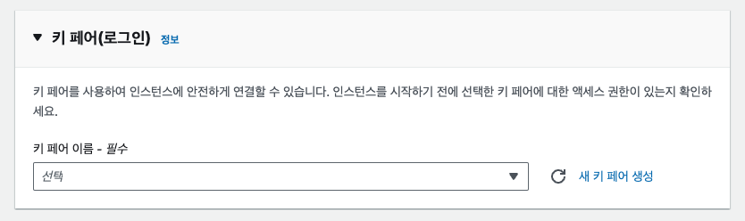 <!-- 키 페어 생성 버튼 -->
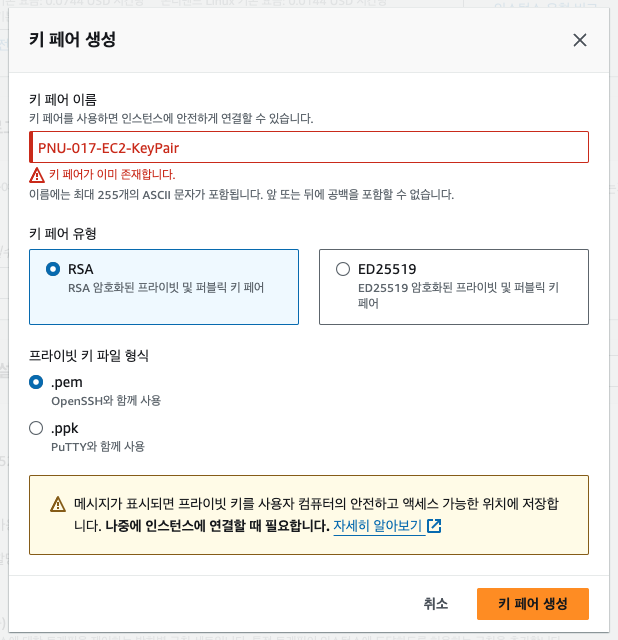 <!-- 키 페어 생성 박스 -->
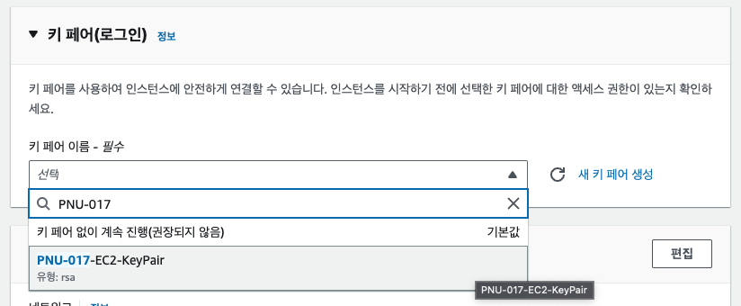 <!-- 키 페어 선택 박스 -->
- 네트워크 설정 편집

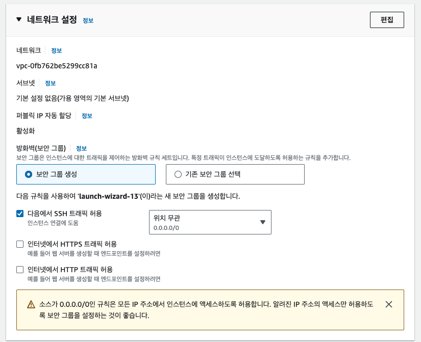 <!-- 네트워크 설정 편집 버튼 -->
- 새 보안 그룹 생성 및 설정

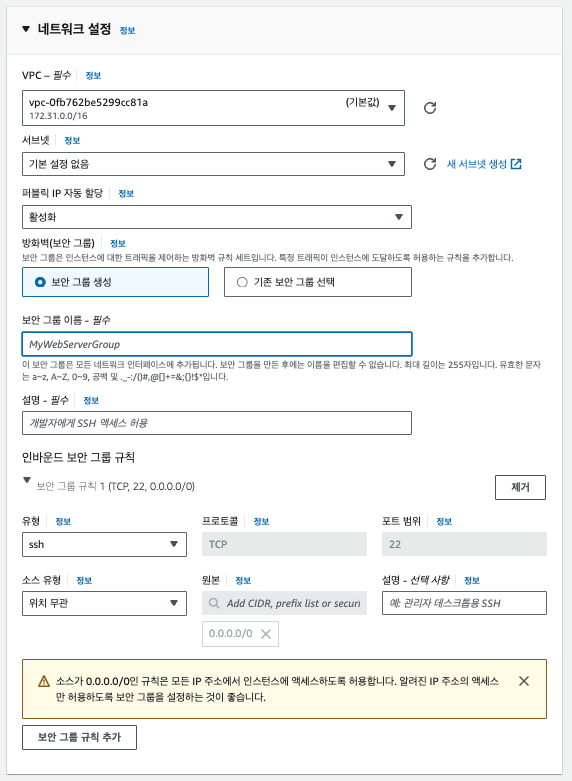 <!-- 보안 그룹 생성 박스(empty) -->
- - -
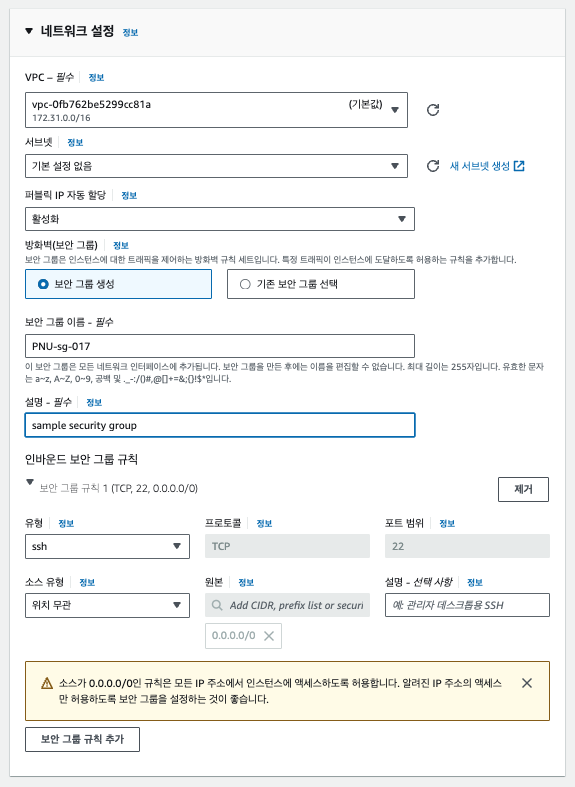 <!-- 보안 그룹 이름 및 설명 추가하기 -->
- - -
터미널을 통한 ssh 접속을 위해 기본적으로 열려있는 22번 포트 외에, 웹 서버로 사용하기 위해 http 포트도 열어주기
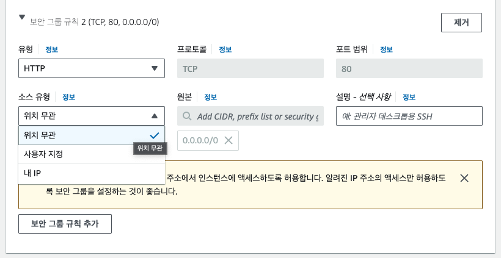 <!-- 보안 그룹 규칙 추가 -->
- - -
- 스토리지 구성 선택

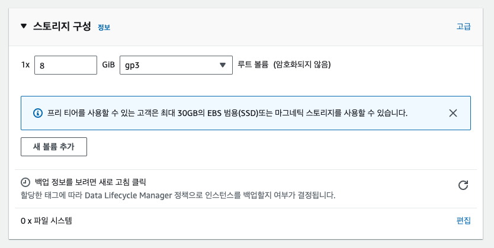 <!-- 스토리지 용량 선택 박스 -->
- 설정 끗

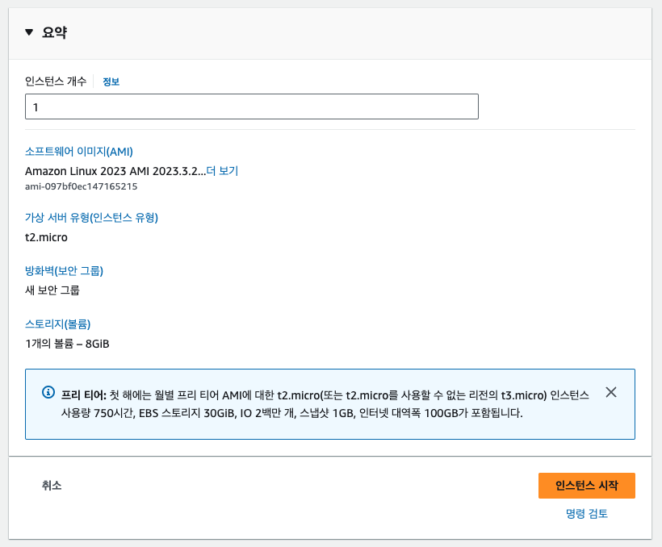 <!-- success -->
